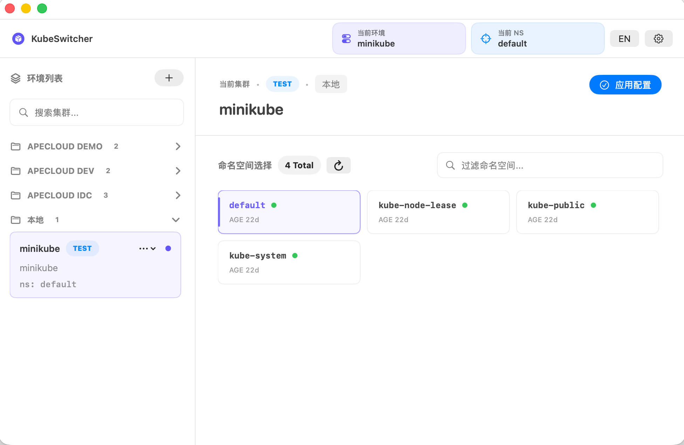

# KubeSwitcher

[中文](README-CN.md) | English

KubeSwitcher is a small macOS menu-bar app for people who manage many Kubernetes environments locally and switch between them all day.

It is built for operators and developers who already use terminal tools like `kubectl`, `kubens`, `kubectx`, and `k9s`, but want a faster way to pick the kubeconfig and namespace before returning to the terminal.



## What It Does

- Register Kubernetes environments from pasted or imported kubeconfig files.
- Organize environments with simple freeform groups.
- Mark environments as `TEST` or `PROD`.
- Preview and pick namespaces before applying an environment.
- Apply the selected kubeconfig and namespace to your configured kubeconfig path.
- Back up the existing kubeconfig before overwriting it.
- Show or hide the app with a configurable global hotkey. The default is `Command + K`.
- Switch UI language between Chinese and English.

## How It Works

KubeSwitcher keeps environment metadata under your configured persistence directory. Kubeconfig contents are stored in macOS Keychain.

When you click **Apply Config**, KubeSwitcher writes the selected environment to the configured kubeconfig path. The default path is:

```text
~/.kube/config
```

Before writing, it creates a timestamped backup next to that file.

`kubectl` is required. KubeSwitcher uses your local `kubectl` to validate kubeconfigs and list namespaces.

## Import and Export

Use the share menu to the left of Settings:

- **Export** opens a grouped selection tree with all environments selected, followed by the system Save dialog for a JSON file.
- **Import** opens the system Open dialog. Entries with an existing group/name pair are skipped and counted as failures; other entries continue importing.
- A toast reports the success count and includes the failure count only when nonzero.

The versioned KubeSwitcher JSON file includes names, groups, kinds, descriptions, namespaces, and full kubeconfigs. Local preferences and the active environment are not changed. Credentials are exported in plain text; share only with trusted colleagues. Kubeconfigs referencing local certificate files or external authentication tools still require those files or tools on the receiving machine.

## Settings

Open Settings from the top-right gear button. You can configure:

- Default kubeconfig path.
- Environment persistence directory.
- Whether clearing app data also removes the persistence directory.
- Global show/hide hotkey.

## GitHub Description

Fast macOS menu-bar switcher for local Kubernetes kubeconfigs and namespaces.

## Note

On first install via dmg, you need to manually grant trust in System Settings > Privacy & Security > Security.
